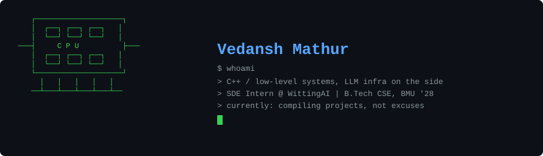
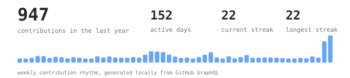
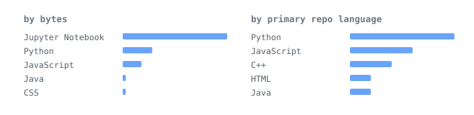
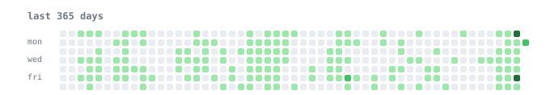

<div align="center">



[linkedin](https://www.linkedin.com/in/vedansh-mathur-86767a300/) &nbsp;·&nbsp;
[github](https://github.com/vedanshmathur7) &nbsp;·&nbsp;
[email](mailto:vedanshmathur007@gmail.com) &nbsp;·&nbsp;
[resume](https://github.com/user-attachments/files/22764225/Vedansh_Mathur_resume.pdf)

</div>


> B.Tech CSE student at BML Munjal University, working in AI backend systems.<br>
> I care about services that survive real data, real latency, and real product pressure.

I build FastAPI services, LLM inference workflows, RAG pipelines, and evaluation<br>
tools around production-ish constraints: async execution, database state,<br>
containerized deploys, cloud storage, and model-provider quirks.

Right now my strongest public signal is AI backend work. The next signal I want<br>
to earn is systems depth: C++ projects with benchmarks, memory, and runtime<br>
behavior visible in the README, not just listed as a skill.


<samp>
python &nbsp; c++ &nbsp; c &nbsp; javascript &nbsp; sql &nbsp; java<br>
fastapi &nbsp; asyncio &nbsp; sqlalchemy &nbsp; postgres &nbsp; mysql &nbsp; redis &nbsp; celery<br>
vllm &nbsp; rag &nbsp; llm-evals &nbsp; openai/groq/gemini &nbsp; docker &nbsp; aws-ec2/s3
</samp>


**CallLevelAnalytics** &nbsp;·&nbsp; <samp>python, fastapi, asyncio, postgres</samp><br>
LLM audit workbench for comparing model-generated call-quality scores against<br>
human ground truth across a 39-parameter scorecard and multi-provider grading.

**DataVox** &nbsp;·&nbsp; <samp>python, fastapi, vllm, docker, aws</samp><br>
AI analytics platform work at WittingAI: inference microservices, LoRA adapter<br>
loading from S3, GPU instance deployment, and model-training pipeline support.

**[ModelArena](https://github.com/vedanshmathur7/ModelArena)** &nbsp;·&nbsp; <samp>python, streamlit, llm benchmarking</samp><br>
Comparative assistant platform evaluating Qwen2.5 and Llama 3.1-8B with memory,<br>
safety filtering, latency benchmarking, and an interactive UI.

**[PlagLe](https://github.com/vedanshmathur7/PlagLe)** &nbsp;·&nbsp; <samp>fastapi, mysql, docker</samp><br>
Backend for multi-document plagiarism analysis with similarity scoring and<br>
structured report generation.


<div align="center">







</div>


```text
ship next:
  01. publish CallLevelAnalytics cleanly, or replace it here with a public repo
  02. pin repos in this order: CallLevelAnalytics, ModelArena, PlagLe, Greywater, then best 2 recent apps
  03. build one C++ systems repo: cache-aware benchmarks or a small allocator
  04. publish a personal site that expands these projects beyond a GitHub README
```

Every graphic in this README is generated inside this repo. The scheduled<br>
workflow uses GitHub's GraphQL API and commits only local SVG assets, so the<br>
profile does not depend on third-party stat-card services.
